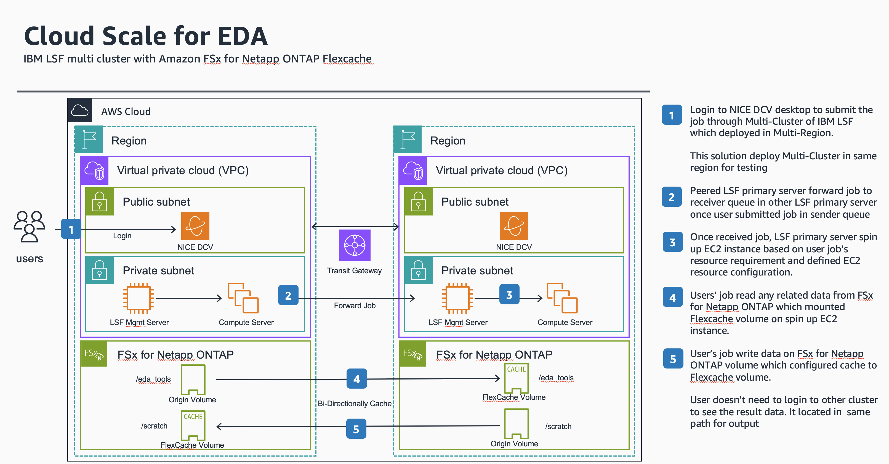

# Guidance for Scaling Electronic Design Automation (EDA) on AWS

## Table of Content 

1. [Overview](#overview)
    - [Archiecture](#reference-architecture)
    - [Cost](#cost)
2. [Prerequisites](#prerequisites)
    - [Operating System](#operating-system)
3. [Deployment Steps](#deployment-steps)
4. [Deployment Validation](#deployment-validation)
5. [Running the Guidance](#running-the-guidance)
6. [Next Steps](#next-steps)
7. [Cleanup](#cleanup)


## Overview

This Guidance demonstrates how to implement a cloud-bursting solution that seamlessly extends your on-premises semiconductor workflows to the cloud. It allows you to run hybrid or entirely cloud-based semiconductor design and verification workflows on AWS while utilizing your existing on-premises chip design environments based on IBM Spectrum Load Sharing Facility (LSF) and NetApp storage.

### Reference Architecture



### Cost

You are responsible for the cost of the AWS services used while running this Guidance. As of publication, the cost for running this Guidance with the default settings in the AWS Region(us-west-2) is approximately $1,556 per month for deploying EDA infrastrcuture(2 of IBM Spectrum LSF Primary Server, 2 of NICE DCV Login Server, 2 of FSx for Netapp ONTAP file system).


### Sample Cost Table


The following table provides a sample cost breakdown for deploying this Guidance with the default parameters in the US West (Oregon) Region for one month.

| AWS service  | Dimensions | Cost [USD] |
| ----------- | ------------ | ------------ |
| Amazon EC2(m5.2xlarge) | IBM Specturm LSF Primary servers(2)  | $560.64 month |
| Amazon EC2(m5.xlarge) | NICE DCV Login servers(2) | $280.32month |
| FSx for Netapp ONTAP | 2 File Systems |  $638.76month |
| Transit Gateway| Peering two VPC | $77.00month |

## Prerequisites
The following is required to run this guidance.

1. License/Full Linux(x86 and aarch64) distribution packages for IBM Spectrum LSF 10.1
2. NICE DCV Remote Desktop Client(Optional) 
2. A free subscription to the [Official CentOS 7 x86_64 HVM AMI](https://aws.amazon.com/marketplace/pp/prodview-foff247vr2zfw)
3. Amazon EC2 Key Pair

#### 1. Obtain IBM Spectrum LSF Software

The IBM Spectrum LSF software is not provided in this guidance; you will need to download LSF 10.1 Fix Pack 8 or later and an associated entitlement file from your IBM Passport Advantage portal to complete this tutorial. See the details [Third-part tools](#third-party-tools)

#### 2. Download NICE DCV Remote Desktop Client (Optional)

**NICE DCV** is a license-free, high-performance remote display protocol that you'll use for logging into the login server's desktop environment. Download and install the [NICE DCV remote desktop native client](https://download.nice-dcv.com/) on the computer you will be using for this workshop.

#### 3. Subscribe the CentOS 7 AMI

The Official CentOS 7 x86_64 HVM image that has been built with a minimal profile, suitable for use in HVM instance types only. The image contains just enough packages to run within AWS, bring up an SSH Server and allow users to login.

Sign in to your AWS account, and follow these instructions to subscribe:

1. Open the page for the [CentOS 7 (x86_64) - with Updates HVM AMI](https://aws.amazon.com/marketplace/pp/prodview-foff247vr2zfw) in AWS Marketplace, and then choose Purchase options.
2. Review the terms and conditions for software usage, and then choose Accept Terms. You will get a confirmation page, and an email confirmation will be sent to the account owner. For detailed subscription instructions, see the [AWS Marketplace documentation](https://aws.amazon.com/marketplace/help/200799470).
3. When the subscription process is complete, exit out of AWS Marketplace without further action. Do not click Continue to Launch; the workshop CloudFormation templates will deploy the AMI for you.
4. Verify the subscriptions in the [Marketplace dashboard](https://console.aws.amazon.com/marketplace/home) within the AWS Console.
   - Click on Manage subscriptions to confirm that the two AMI subscriptions are active in your account.

#### 4. Prepare Amazon EC2 Key Pair

Make sure that at least one Amazon EC2 key pair exists in your AWS account in the region where you are planning to deploy the tutorial. Make note of the key pair name. You’ll be prompted for this information during deployment. To create a key pair, follow the instructions in the AWS documentation. If you’re deploying the tutorial for testing or proof-of-concept purposes, we recommend that you create a new key pair instead of specifying a key pair that’s already being used by a production instance.

### Operating System 
This guidance based on two Linux systems(CentOS 7 and Amazon Linux 2)for deploying the EDA environment. To use CentOS 7, it requred to susbscribe the CentOS 7 AMI. [Subscription](https://aws.amazon.com/marketplace/pp/prodview-foff247vr2zfw)

### Third-party tools
Download the following packages from IBM:

| **Kind**          | **IBM Download Source** | **Description** | **Package Name**                                   |
| ----------------- | ----------------------- | --------------- | -------------------------------------------------- |
| Install Script    | Passport Advantage      | \--             | lsf10.1_lsfinstall_linux_x86_64.tar.Z              |
| Base Distribution(x86) | Passport Advantage | \--             | lsf10.1_linux2.6-glibc2.3-x86_64.tar.Z             |
| Base Distribution(arm64) | Passport Advantage | \--           | lsf10.1_lnx312-lib217-armv8.tar.Z                  |
| Entitlement File  | Passport Advantage      | \--             | lsf_std_entitlement.dat or lsf_adv_entitlement.dat |
| Fix Pack(x86)     | Passport Advantage      | \--             | lsf10.1_linux2.6-glibc2.3-x86_64-601547.tar.Z      |
| Fix Pack(arm64)   | Passport Advantage      | \--             | lsf10.1_lnx312-lib217-armv8-601547.tar.Z           |


### AWS account requirements

“This deployment requires you have S3 bucket to store Cloud Formation Templates and IBM installation binaries. ACM certificate available in your AWS account”


### Service limits 

You might need to do this if you already have an existing deployment that uses these resources, and you think you might exceed the default limits with this deployment. For default limits, see the [AWS documentation](http://docs.aws.amazon.com/general/latest/gr/aws_service_limits.html). [AWS Trusted Advisor](https://console.aws.amazon.com/trustedadvisor/home?#/category/service-limits) offers a service limits check that displays your usage and limits for some aspects of some services.

| **AWS Resource**    | **Deployment Requirements** |
| ------------------- | --------------------------- |
| VPCs                | 2                           |
| Internet Gateway    | 2                           |
| NAT Gateway         | 2                           |
| Transit Gateway     | 1                           |
| IAM Security Groups | *                           |
| IAM Roles           | 4                           |
| EFS File System     | 1                           |
| FSx for Netapp      | 2                           |
| m5.xlarge instance  | 2                           |
| m5.2xlarge instance | 2                           |


### Supported Regions

This deployment includes **Amazon Elastic File System** (EFS) and **Amazon FSx for NetApp ONTAP**, which aren't currently supported in all AWS regions. For a current list of supported regions for AWS services, please see [AWS Regional Services List documentation](https://aws.amazon.com/about-aws/global-infrastructure/regional-product-services/).


## Deployment Steps

1. Sign in to your AWS account at [https://aws.amazon.com/](https://aws.amazon.com) with an IAM user role that includes full administrative permissions.
2. Select the region where your EC2 key pair exists.
3. Create S3 Bucket. The CloudFormation templates for this workshop reads **IBM Spectrum LSF** and **Cloud Scale for EDA** source files from an [Amazon S3](https://aws.amazon.com/s3/) bucket in your AWS account. You must create a new bucket for this workshop. You can review instructions on how to [create a new S3 bucket](https://docs.aws.amazon.com/AmazonS3/latest/userguide/create-bucket-overview.html) in the AWS documentation.

   > [!NOTE]
   > Be sure you create the bucket in the same region as your EC2 key pair.

4. Clone the repo using command ```git clone https://github.com/aws-solutions-library-samples/guidance-for-cloud-scale-eda-on-aws``` in your local computer.

5. Upload the folder where you clone from Git repo in previous step, into the S3 bucket that you created above. Once uploaded successfully, the folder structure under the S3 bucket root should have the following structure:

   > [!NOTE]
   > The directory name in the Amazon S3 bucket should match the directory structure provided below. The specific directory name may differ if the repository is cloned from a Git repository. It is important to ensure the directory name in the S3 bucket aligns with the structure outlined.

   ```
   eda-workshop-cloud-scale/assets
   eda-workshop-cloud-scale/deployment
   eda-workshop-cloud-scale/source
   ```

In addition, `LICENSE.txt`, `NOTICE.txt`, and `README.md` files will be located at the root level.

6. Upload LSF Package to S3 bucket. Upload the **IBM Spectrum LSF** binaries and entitlement files into the same S3 bucket. The LSF files retrieved from S3 by the **Cloud Scale** CloudFormation code.

7. Go to the **Amazon S3** console and click on the S3 bucket you created above to descend into the folder.
   * Click on `deployment`.
   * Click on the checkbox next to `run-eda-workshop.yaml` and click the **Copy URL** button towards the top of the page.

8. Go to the **CloudFormation** console from the AWS Management Console in your account and Click on **Create Stack with New Resources.**
 
9. In the **Specify template** section of **Create Stack**, select **Amazon S3 URL** and paste the S3 URL that you copied in Step 2.2 above. It should be similar to [`https://<YOUR-BUCKET>.s3.us-west-2.amazonaws.com/eda-workshop-cloud-scale/deployment/run-eda-workshop.yaml`]. After then, choose **Next**.

10. On the **Specify stack** details page, specify the Stack name.

11. On the **Parameters** section:
   - review the parameters for the template. 
   - Provide values for the following parameters in the table below. 
   - For all other parameters, it is recommended that you keep the default settings, but you can customize them as necessary.

| **Section** | **Parameter**            | **Notes**                                                                                                                                  |
|-------------| ------------------------ | ------------------------------------------------------------------------------------------------------------------------------------------ |
| Source Location | SourceS3Bucket           | S3 Bucket where source code for **Cloud Scale for EDA** is stored.                                                                         |
| Flow Configuration | Type of Flow to run      | MultiCluster                                       |
| Network Configuration | Region-B(Cloud) VPC CIDR range  | Please keep default VPC CIDR(172.16.0.0/16) |
| Network Configuration | Region-A(On-Prem) VPC CIDR range | Please keep default VPC CIDR(10.0.0.0/16) |
| Network Configuration | Availability Zone | Depends on your region(Default : us-west-2a) |
| Network Configuration | Availability Zone | Depends on your region(Default : us-west-2d) |
| Network Configuration | SSH source CIDR          | Enter the internet-facing IP from which you will log into the login server ([http://checkip.amazonaws.com](http://checkip.amazonaws.com)). |
| Network Configuration | EC2 KeyPair              | The name of an existing EC2 KeyPair to enable SSH access to the master server.                                                             |
| File system configuration | Scratch directory | The name of directory for scratching(Default : scratch) |
| File system configuration | Project directory | The name of directory for project(Default : eda_tools) |
| LSF configuration | LSF install path | The name of directory for LSF installation(Default : /tools/ibm/lsf) |
| LSF configuration | Cluster name | The name of LSF cluster(Default : myawscluster) |
| LSF configuration | LSF 10.1 install script package      | Enter the S3 protocol URL for the `lsf10.1_lsfinstall_linux_x86_64.tar.Z` (Replace the bucket name on <your_bucket>)                                                          |
| LSF configuration | LSF 10.1 Linux base distribution package(x86) | Enter the S3 protocol URL for the `lsf10.1_linux2.6-glibc2.3-x86_64.tar.Z` (Replace the bucket name on <your_bucket>)                                                    |
| LSF configuration | LSF 10.1 Linux base distribution package(arm64) | Enter the S3 protocol URL for the `lsf10.1_lnx312-lib217-armv8.tar.Z` (Replace the bucket name on <your_bucket>)                                                         |
| LSF configuration | LSF entitlement file     | Enter the S3 protocol URL for the LSF entitlement file. This should be either lsf_std_entitlement.dat or lsf_adv_entitlement.dat.          |
| LSF configuration | LSF 10.1 Fix pack package(x86)     | Enter the S3 protocol URL for the `lsf10.1_linux2.6-glibc2.3-x86_64-######.tar.Z` (Replace the bucket name on <your_bucket>)                                             |
| LSF configuration | LSF 10.1 Fix pack package(arm64)   | Enter the S3 protocol URL for the `lsf10.1_lnx312-lib217-armv8-######.tar.Z` (Replace the bucket name on <your_bucket>)                                                  |
| LSF configuration | LSF management server instance type | Choose the type of EC2 instance for LSF management server(Default : m5.2xlarge) |
| LSF configuration | LSF management server AMI | choose the Amazon Machine Image for OS of LSF management server(Default : ALinux2) |
| LSF configuration | Compute node AMI | choose the Amazon Machine Image for OS of compute node(Default : CentOS75) |
| Login server configuration | Login server instance type | Choose the type of EC2 instance for Login server(Default : m5.xlarge) |
| Login server configuration | Login server AMI | Choose the type of Amazon Machine Image for OS of Login server(Default : ALinux2) |
| Login server configuration | Username for remote desktop login server | Enter the username for login and submitting the job(Default : simuser) |
| Amazon FSx for NetApp ONTAP filesystem parameters | Filesystem storage type | Choose the type of storage(Currently onle SSD able to use) |
| Amazon FSx for NetApp ONTAP filesystem parameters | Storage capacity of the Amazon FSx for NetApp ONTAP filesystem | Enter the size(GB) of storage(Default : 1024) |
| Amazon FSx for NetApp ONTAP filesystem parameters| Throughput capacity of the Amazon FSx for NetApp ONTAP filesystem | Enter the size(MB/s) of throughput(Default : 256) |
| Amazon FSx for NetApp ONTAP storage virtual machine and volume parameters | Security style of the root volume | Choose the security style of the root volume(Default : UNIX) |
| Amazon FSx for NetApp ONTAP storage virtual machine and volume parameters | Tiering policy for the volume | Choose the tiering policy (Default : AUTO) |
| Amazon FSx for NetApp ONTAP storage virtual machine and volume parameters | Size of the volume in MB(MegaBytes) | Enter the size of volume(Default : 102400) |
| Amazon FSx for NetApp ONTAP storage virtual machine and volume parameters | Storage efficiency configuration | Choose True of False to enable storage efficiency feature which volume level that include compression, compaction, and deduplication (Default : true) |
| Amazon FSx for NetApp ONTAP storage virtual machine and volume parameters | Threshold of alarm | Enter the storage capacity threshold(%) for alarm (Default : 90) |


When you finish reviewing and customizing the parameters, choose **Next**.

12. On the **Configure stack options** page, you can specify [tags ](https://docs.aws.amazon.com/AWSCloudFormation/latest/UserGuide/aws-properties-resource-tags.html)(key-value pairs) for resources in your stack. We recommend setting key to `env` and value to `aws-cloud-scale-eda` or something similar. This will help to identify resources created by this tutorial.

Also, in the **Stack Failure Options**, we recommend choosing **Preserve successfully provisioned resources**. This preserves the resources of the CloudFormation Stack instead of cleaning up stack on deployment failure, thereby facilitating debug. 

Under **Capabilities** at the very bottom, select the two check boxes to acknowledge that the template will create IAM resources and that it might require the capability to auto-expand macros. When you're done, choose **Next**.

On the **Review** page, review and confirm the template settings. 

Choose **Submit** to deploy the stack. The deployment takes approximately **40-50 minutes** to complete.


## Deployment Validation


* Open CloudFormation console and verify the status of the template
* If deployment is successful,the status is `CREATE_COMPLETE`, the cluster is ready.


## Running the Guidance

1. Log into the AWS Management Console and get the public IPs of the Login servers for both the Region-A(Simulated on-premse) and the Region-B(Cloud) environments.It is advised that you SSH into the login server using the AWS EC2 KeyPair and add `simuser`  to `wheel` group so that simuser can perform operations as root:

`sudo usermod -aG wheel simuser`

2. Once, `simuser` is added to the `wheel` group, you can log in to the login server to interact with the demo by either using SSH (using SSH KeyPair you created) or by logging in to the DCV client (using username `simuser` and obtaining the auto-generated password from **AWS Secrets Manager** in the account).


3. The workload we use for the guidance is representative of input/output characteristics of an EDA workload. For the job, we use a simple script which will untar Python3 source and compile the code. The job reads the `/eda_tools` flexcache volume which we mounted earlier, untars the source to `/scratch` origin volume, and compiles the code. It then outputs a `success.txt` file to indicate successful job completion. The job creates a separate directory for each job using UUID to prevent race conditions because multiple jobs will be running on multiple execution hosts simultaneously.

4. Log into your Login server(Region-A) as `simuser` using SSH and EC2 KeyPair. If you logged in as `ec2-user`, switch user as `simuser`.
5. Run the workload is to simulate an EDA job. The workshop has a script which will:

- Create a working directory in the /scratch origin volume on the WorkerNode
- copy the python tarball into the the /scratch/ folder & untar it
- Build python from source simulating the same type of I/O we'd expect from an EDA job
- Write a success file to the root of the working directory to indicate it's completed

6. Launch a few (you can write a for loop ) instances of the script to see everything come together. Please make sure, your current user is `simuser` to submit the job.

```bash
for i in {1..10}
do
bsub -q sender < /eda_tools/demo_script.sh
done
```

7. The jobs are now submitted to the Region-A(Simulated on-premises) LSF management host and start running. As long as slots are available in the Region-A(Simulated on-premises) LSF management host (4 slots for this workshop), which also doubles a 1 Region-A server, jobs will be scheduled on the server. Other jobs, which would typically wait in the queue, are now forwarded to the LSF management host deployed in the Region-B(Cloud). `bjobs -p` command can be used to look at status of the jobs. On the AWS Management console, you can see EC2 instances called 'Exec Host' spinning up in the AWS cloud VPC.

8. Once the nodes are online, they'll execute the jobs which will start creating work directories on the origin volume in the cloud (/scratch). Results can be monitored by looking in the /scratch directory that is mounted on the Region-A(on-premise) environment.


## Next Steps 

This guidance using IBM LSF resource connector to launch the EC2 instance. Also, it integrated with AWS EC2 fleet API. Our workshop will launch the EC2 as on-dmeand and spot instance based on EC2 fleet configuration which located in [$LSF_ENVDIR/resource_connector/aws/conf/ec2-fleet-config.json]. 
You can configure the Weight or Priroty. For more detail, visit to [IBM LSF Resource Connector Configuration](https://www.ibm.com/docs/en/spectrum-lsf/10.1.0?topic=connector-using-amazon-ec2-fleet)

```json
{
    "OnDemandOptions":{
       "AllocationStrategy": "lowest-price"
    },
    "SpotOptions":{
       "AllocationStrategy": "price-capacity-optimized",
       "InstanceInterruptionBehavior": "terminate"
    },
    "LaunchTemplateConfigs":[
       {
          "LaunchTemplateSpecification":{
             "LaunchTemplateId": "%CFN_LAUNCH_TEMPLATE%",
             "Version":"1"
          },
          "Overrides":[
            {
               "InstanceType":"c5.xlarge",
               "SubnetId":"%CFN_COMPUTE_NODE_SUBNET1%",
               "WeightedCapacity":1,
               "Priority":2
            },
            {
                "InstanceType":"c5.2xlarge",
                "SubnetId":"%CFN_COMPUTE_NODE_SUBNET2%",
                "WeightedCapacity":2,
                "Priority":4
            }
          ]
  }],
 
    "TargetCapacitySpecification":{
       "TotalTargetCapacity": $LSF_TOTAL_TARGET_CAPACITY,
       "OnDemandTargetCapacity": $LSF_ONDEMAND_TARGET_CAPACITY,
       "SpotTargetCapacity": $LSF_SPOT_TARGET_CAPACITY,
       "DefaultTargetCapacityType": "spot"
    },
    "Type":"instant"
 }
```


## Cleanup 

You can tear down the stack in Cloudformation by clicking delete stack. Everything else should tear down neatly.

1. Sign in to your AWS account at [https://aws.amazon.com/](https://aws.amazon.com) using an IAM user role with full administrative permissions.
2. Navigate to the Amazon S3 console:
   - Locate the S3 bucket you created in the previous steps.
   - Click on the bucket name and then select "Delete".
3. Access the EC2 console:
   - Review the list of running instances.
   - If you see instances with the name "LSF Exec Host", ensure that these instances are terminated before proceeding to the next step.
4. Go to the CloudFormation console from the AWS Management Console:
   - Locate the CloudFormation stack you created in the Deployment steps.
   - Select the primary stack (not a nested stack).
   - Click on the "Delete" option.
   - This will delete all nested stacks
5. The status of the stack will change to "DELETE_IN_PROGRESS".
6. Once the cleanup process is complete, the CloudFormation stacks will be empty.


